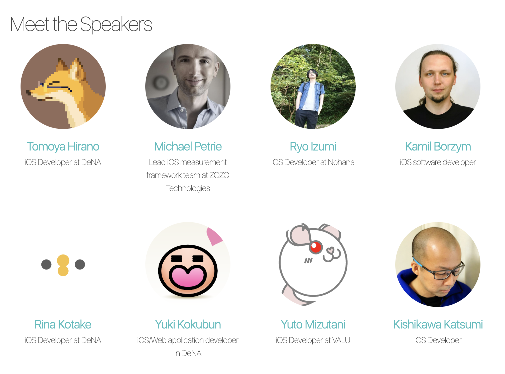

# Making own movie player in iOS

---

# Tomoya Hirano (noppe)

- のっぺ

- DeNA

- twitter.com/noppefoxwolf

- github.com/noppefoxwolf

---

# try!Swift Tokyo 2019

---

<!-- 2019はLTをしました -->

---

# try!Swift Tokyo 2020

---

<!-- 2020では個人スポンサーをしています -->

---

# iOSDC 2019

---

<!-- 整形フィルタの話をしました -->

---

# Pococha

<!-- Pocochaは日本で一番ホットな動画ライブサービスで、チューター２名もPocochaのメンバー -->

---

# Building own movie player in iOS

なんか分かりやすく分解してそうな画像入れたい

---

# 最終ゴール

オリジナルの動画プレーヤーを作る

---

# ゴールの条件

動画が再生されること

<!-- 今日では非常に簡単なこと -->
<!-- 簡単な分いろいろな工夫が出来ます -->

---

# 工夫の例

- シンプルを極める
- フィルターをかけられる
- 動画の内容を解説する
- ...etc

---

# ストレッチ

OSSやAppStoreに出してみましょう

---

# アジェンダ

- 簡単に動画を再生する
- プレーヤーとレンダラを分けて扱う
- プレーヤーを作る
- レンダラを作る
- アセットリーダーを作る

---

# 進め方

自由に進めてもらってOK
<!-- 自由に進めるのが結局一番楽しいから -->
リポジトリの中にいろいろ入ってるから弄って
素材はこの辺にある

---

# 簡単に動画を再生する

---

## 動画プレーヤーの構成１

動画ファイルと動画プレーヤーがあって、動画ファイルをプレーヤーに読み込むと再生される

---

AVPlayerContorller

昔はMPMoviePlayerControllerって言うのがあってもっとeasyだった

AVPlayerControllerにAVPlayerを渡すと、開く
ビデオの形式とか考えなくてもいいので楽

---

## 動画プレーヤーの構成２

AVPlayerControllerとは何か

- レンダラー
    - 動画を描画する
- UI
    - ボタンなど
- プレーヤーコントローラ
    - AVPlayerの状態を監視したりする

好きなUIで作り込むことが出来る

## 動画プレーヤーの構成3

Playerとは何か
動画ファイルを読み込んで、要求された操作に対する結果を接続した各コンポーネントに吐き出す
レンダラはCMSampleBufferを受け取って表示する

再生速度を変更したり出来る

## 動画プレーヤーの構成4

レンダラの自作

CMSampleBufferをenqueuしていたところを自分で書いてみよう
Metalで書くよ

## 動画プレーヤーの構成5

AssetReaderの自作
